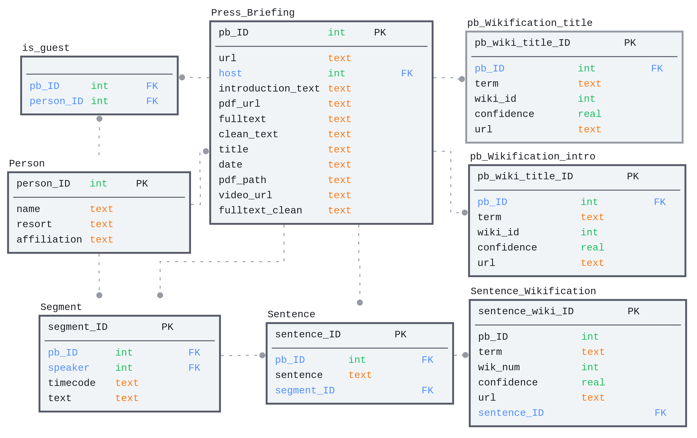

# The SMC claim dataset
### Info 💡
This repository holds the code to create the SMC claim dataset. The main modules can be found in the src directory. Three notebooks in the root directory interface these modules and guide through the dataset creation process.

### Setup 🎛
This repo holds a [Visual Studio Code (VS Code)](https://code.visualstudio.com/) [.devcontainer](https://github.com/jueri/SMC_claim_dataset/tree/master/.devcontainer). The docker development container can easily be recreated using VS Code.
Alternatively, can the dependencies be installed using with the following command:
`pip install -r .devcontainer/requirements.txt`

Default directorys and parameter can be specified in [config.py](https://github.com/jueri/SMC_claim_dataset/tree/master/config.py).

The wikification module relies on two wikification services, [Dandelion](https://dandelion.eu/) and [TagMe](https://sobigdata.d4science.org/web/tagme). API keys for these services can be created for free. The wikify module expects the environment variables `DANDELION_TOKEN` and `TAGME_TOKEN`.

### Content 📋
- [data/SMC_dataset](https://github.com/jueri/SMC_claim_dataset/tree/master/data/SMC_dataset) holds the full dataset as SQLite database and csv tables.
- [src](https://github.com/jueri/SMC_claim_dataset/tree/master/src) conatins main modules to scrape, parse and import the data.
- [create_dataset.ipynb](https://github.com/jueri/SMC_claim_dataset/tree/master/create_dataset.ipynb) guieds through the database creation process.
- [create_tables.ipynb](https://github.com/jueri/SMC_claim_dataset/tree/master/create_tables.ipynb) guides through the table creation process.
- [dataset_analysis.ipynb](https://github.com/jueri/SMC_claim_dataset/tree/master/dataset_analysis.ipynb) holds the full analysis of the dataset. 

### Dataset 💾
Since these repository is not public available, the full dataset can be found in the `data` directory. The SQLite database `dataset.db` has the following structure:

